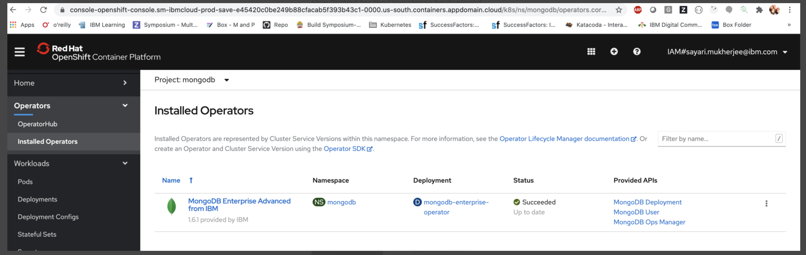
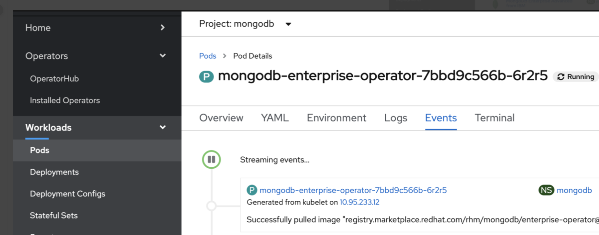
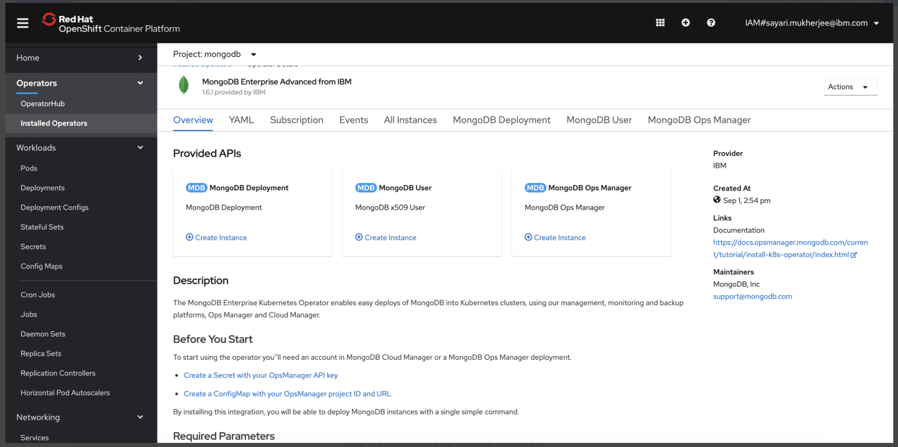
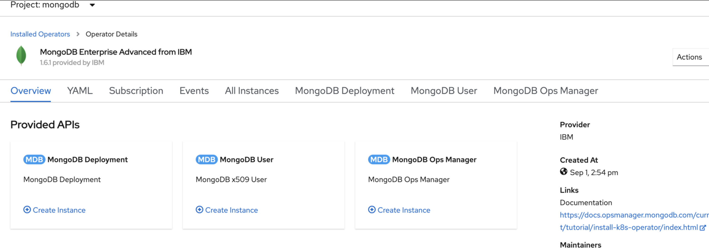
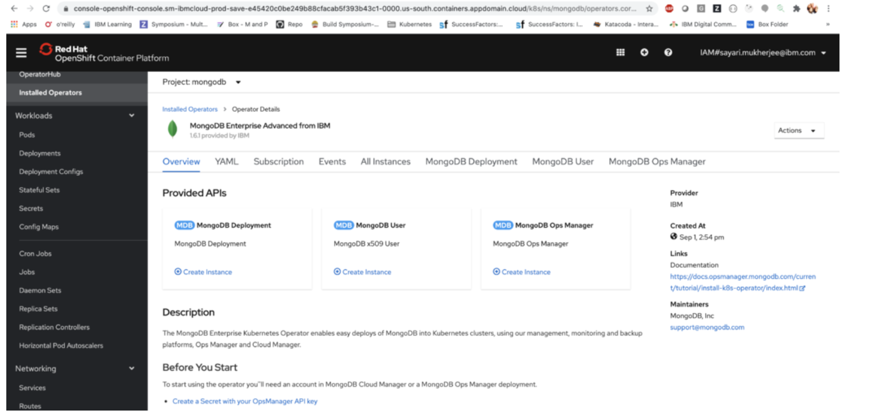
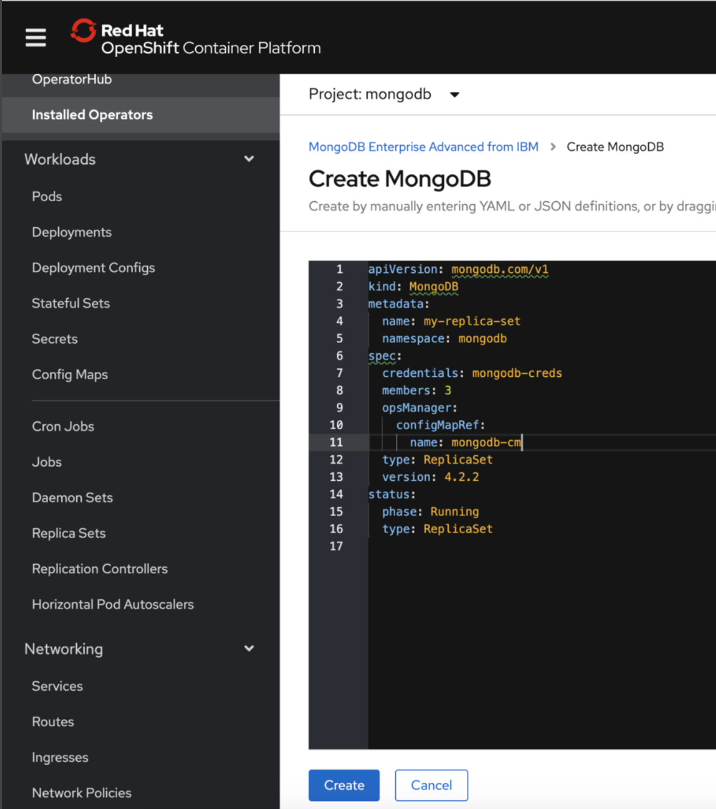
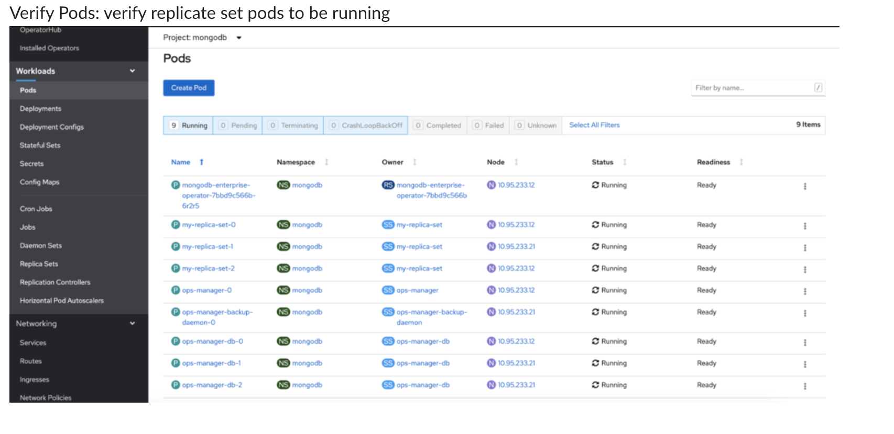

# OpenShift MongoDB Enterprise Kubernetes Operator 
## Operator Service Catalog and Marketplace

This installation document is a guide for deploying MongoDB Enterprise Kubernetes Operator, Ops Manager and first MongoDB DataBase using OpenShift Operator catalog or Marketplace. 

## Configuring required components

Step 1: Create a namespace to install MongoDB

```
oc create ns mongodb
```

Step 2: Install the operator in the cluster in the namespace created above



Step 3: Wait for the Operator to be deployed.



Step 4: Deploy MongoDB Ops Manager.

Ops Manager is an Enterprise Control Plane for all your MongoDB Clusters. It is a extensive application and may seem complicated. Please visit [Documentation](https://docs.mongodb.com/kubernetes-operator/stable/om-resources/) to plan and configure production deployments. 

*Only a single Ops Manager deployment is required for all MongoDB clusters in your organization. This step could be skipped if Ops Manager is already deployed. Alternatively [Cloud Manager](https://cloud.mongodb.com) - hosted Ops Manager could be used instead.*




To deploy a very simple Ops Manager configuration two steps are required.
1. Create Admin Credential Secret
```bash
create secret generic ops-manager-admin-secret  \
--from-literal=Username="jane.doe@example.com" \
--from-literal=Password="Passw0rd." \
--from-literal=FirstName="Jane" \
--from-literal=LastName="Doe" -n mongodb
```
2. Deploy Ops Manager instance with CRD


With sample yaml CRD definition

```yaml
apiVersion: mongodb.com/v1
kind: MongoDBOpsManager
metadata:
  name: ops-manager
  namespace: mongodb
spec:
  # the version of Ops Manager to use
  version: 4.4.1

  # the name of the secret containing admin user credentials.
  adminCredentials: ops-manager-admin-secret

  externalConnectivity:
    type: LoadBalancer

  # the Replica Set backing Ops Manager. 
  # appDB has the SCRAM-SHA authentication mode always enabled
  applicationDatabase:
    members: 3
```

Change the `adminCredentials` property to link to the name of the secret created previously. In this example it is ops-manager-admin. 

`Click create.` 

>For more detailed installation visit our blog post: https://www.mongodb.com/blog/post/running-mongodb-ops-manager-in-kubernetes

Step 7: Verify MongoDB Ops Manager is successfully deployed. Verify Ops Manager resource and ensure that ops-manager resource reached Running state : 
`oc describe om ops-manager`


>NOTE: Wait for the secret ops-manager-admin-key to be created. It contains Global Admin Programmatic API that will be required in the subsequent steps. We recommend to create new Programmatic API Key scoped to a single Ops Manager Organization https://docs.opsmanager.mongodb.com/rapid/tutorial/manage-programmatic-api-keys/#mms-prog-api-key


Please note OpsManager URL exposed by LoadBalancer before moving to the next Section

## Deploy MongoDB

In order to create MongoDB Cluster three Kubernetes resources need to be deployed. https://docs.mongodb.com/kubernetes-operator/stable/mdb-resources/

1. Kubernetes ConfigMap that contain settings for Operator to connect to Ops Manager
  ```bash
  os create configmap <configmap-name> \
    --from-literal="baseUrl=<OpsManagerURL>" \
    --from-literal="projectName=<myOpsManagerProjectName>" \ #Optional
    --from-literal="orgId=<Ops Manager OrgID>" 
  ```
 >OpsManagerURL is an Ops Manager url including port (default 8080) noted in Step 7.

>Documentation: https://docs.mongodb.com/kubernetes-operator/stable/tutorial/create-project-using-configmap/#create-k8s-project


2. Kubernetes Secret containing Programmatic API Key to Operator to connect to Ops Manager.
> ops-manager-admin-key secret could be used instead for none production deployments.

```
oc -n <metadata.namespace> \
  create secret generic <myCredentials> \
  --from-literal="user=<publicKey>" \
  --from-literal="publicApiKey=<privateKey>"
  ```

For instructions on how to create Ops Manager Organization and Programmatic API Key please refer to documentation: https://docs.mongodb.com/kubernetes-operator/stable/tutorial/create-operator-credentials/#create-k8s-credentials

3. Deploy Ops Manager 


Click on the first tile to create the MongoDB Deployment Instance



* Choose a name for MongoDB cluster 'metadata.name`
* Substitute the values `spec.OpsManager` with a reference to the config map `<configmap-name>` 
* Substitute the values `spec.credentials`  with secret name `<myCredentials>`. 

`Click Create. `

>For comprehensive Documentation, please visit https://docs.mongodb.com/kubernetes-operator/stable/mdb-resources/

### Verify MongoDB cluster is operational

Verify Status of MongoDB Resource reached ``Running`` state
>Optionally monitor state of pods, sts and services linked to MongoDB CRD


>Note: MongoDB Enterprise Operator logs are the best source to start troubleshooting any issues with deployments

### Connect to MongoDB Cluster

MongoDB Enterprise Operator create Kubernetes Service For each MongoDB deployed using default port 27017.

` <mongodb-service-name>.<k8s-namespace>.svc.<cluster-name>`

MongoDB Connection String could be built using SRV record 

` mongodb+srv://<mongodb-service-name>.<k8s-namespace>.svc.<cluster-name>`

***In order to connect to MongoDB from outside of OpenShift cluster an ingress route needs to be created manually. Operator does not create ingress or external services.***

***MongoDB ReplicaSet External connectivity requires Split Horizon Configuration:  [Connect to a MongoDB Database Resource from Outside Kubernetes](https://docs.mongodb.com/kubernetes-operator/stable/tutorial/connect-from-outside-k8s/)***

>EXAMPLE
To connect to a sharded cluster resource named shardedcluster, you might use the following connection string: <br/> ``mongo --host shardedcluster-mongos-0.shardedcluster-svc.mongodb.svc.cluster.local --port 27017``

